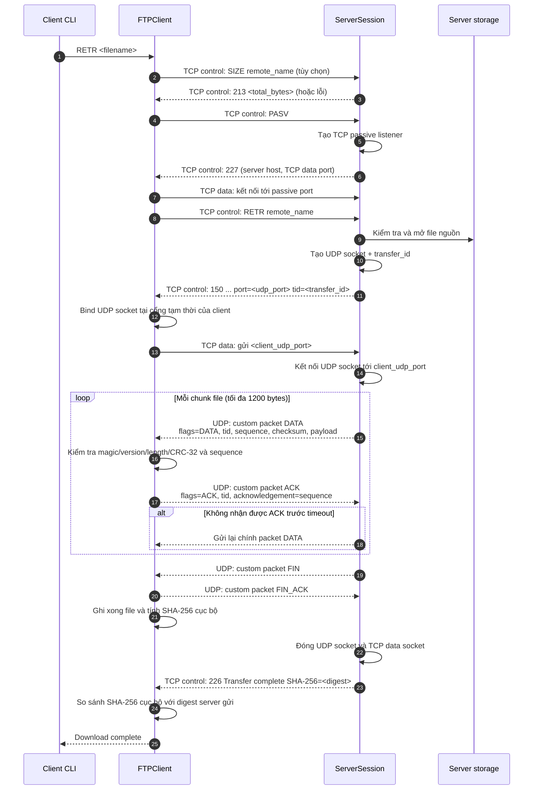

# Luồng tải file (`RETR`)

Sơ đồ này mô tả luồng tải file mặc định của dự án: **passive mode**. TCP được dùng để điều khiển và phối hợp; dữ liệu file đi qua các custom Reliable-UDP packet.

## Ý nghĩa các kênh trong sơ đồ

- **TCP control**: gửi lệnh FTP (`SIZE`, `PASV`, `RETR`) và nhận response (`213`, `227`, `150`, `226`).
- **TCP data**: chỉ dùng ngắn hạn để client báo UDP port của nó cho server trong passive mode; không mang byte file.
- **UDP**: mang các packet `DATA`, `ACK`, `FIN`, `FIN_ACK`. Mỗi UDP datagram có UDP header chuẩn do hệ điều hành thêm và custom Reliable-UDP header 22 bytes do `common/packet.py` mã hóa.

`150` chứa UDP port và `transfer_id`; `226` chỉ được trả sau khi quá trình UDP hoàn thành và server đã có SHA-256 của file.
